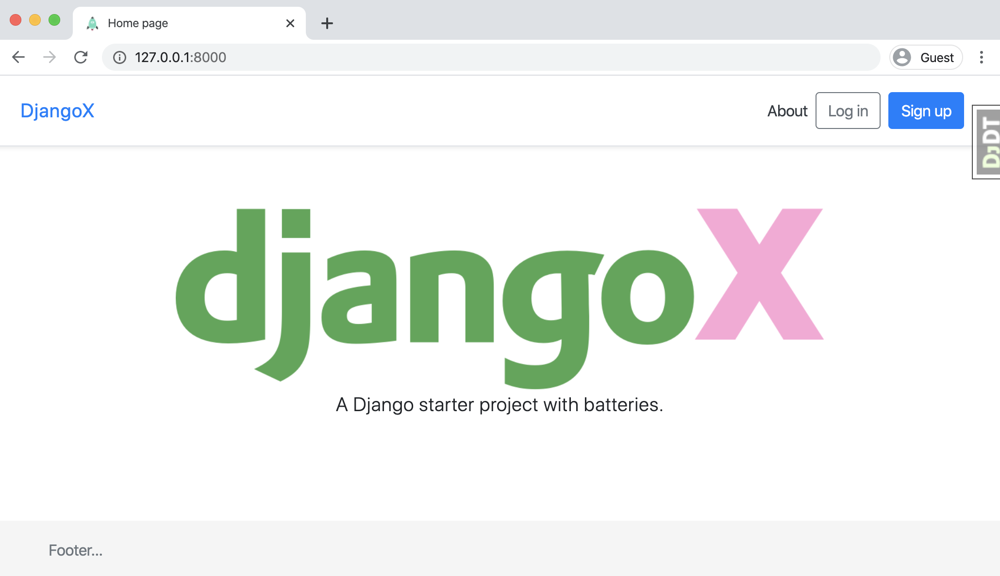

> A batteries-included Django starter project. For a production-ready version see the book [Django for Professionals](https://djangoforprofessionals.com).

## 🚀 Features

- Django 3.1 & Python 3.8
- Install via [Pip](https://pypi.org/project/pip/), [Pipenv](https://pypi.org/project/pipenv/), or [Docker](https://www.docker.com/)
- User log in/out, sign up, password reset via [django-allauth](https://github.com/pennersr/django-allauth)
- Static files configured with [Whitenoise](http://whitenoise.evans.io/en/stable/index.html)
- Styling with [Bootstrap v4](https://github.com/twbs/bootstrap)
- Debugging with [django-debug-toolbar](https://github.com/jazzband/django-debug-toolbar)
- DRY forms with [django-crispy-forms](https://github.com/django-crispy-forms/django-crispy-forms)


----

## Table of Contents
* **[Installation](#installation)**
  * [Pip](#pip)
  * [Pipenv](#pipenv)
  * [Docker](#docker)
* [Setup](#setup)
* [Contributing](#contributing)
* [Support](#support)
* [License](#license)

----

## 📖 Installation
DjangoX can be installed via Pip, Pipenv, or Docker depending upon your setup. To start, clone the repo to your local computer and change into the proper directory.

```
$ git clone https://github.com/wsvincent/djangox.git
$ cd djangox
```

### Pip

```
$ python3 -m venv djangox
$ source djangox/bin/activate
(djangox) $ pip install -r requirements.txt
(djangox) $ python manage.py migrate
(djangox) $ python manage.py createsuperuser
(djangox) $ python manage.py runserver
# Load the site at http://127.0.0.1:8000
```

### Pipenv

```
$ pipenv install
$ pipenv shell
(djangox) $ python manage.py migrate
(djangox) $ python manage.py createsuperuser
(djangox) $ python manage.py runserver
# Load the site at http://127.0.0.1:8000
```

### Docker

```
$ docker build .
$ docker-compose up -d
$ docker-compose exec web python manage.py migrate
$ docker-compose exec web python manage.py createsuperuser
# Load the site at http://127.0.0.1:8000
```

For Docker, the `INTERNAL_IPS` configuration in `config/settings.py` must be updated to the following:

```python
# config/settings.py
# django-debug-toolbar
import socket
hostname, _, ips = socket.gethostbyname_ex(socket.gethostname())
INTERNAL_IPS = [ip[:-1] + "1" for ip in ips]
```

## Setup

```
# Run Migrations
(djangox) $ python manage.py migrate

# Create a Superuser
(djangox) $ python manage.py createsuperuser

# Confirm everything is working:
(djangox) $ python manage.py runserver

# Load the site at http://127.0.0.1:8000
```

----

## 🤝 Contributing

Contributions, issues and feature requests are welcome! See [CONTRIBUTING.md](https://github.com/wsvincent/djangox/blob/master/CONTRIBUTING.md).

## ⭐️ Support

Give a ⭐️  if this project helped you!

## License

[The MIT License](LICENSE)


# DjangoX

PR Link: 

**Author**: Grace Choi
**Version**: 1.0.0

## Overview
<!-- Provide a high level overview of what this application is and why you are building it, beyond the fact that it's an assignment for a Code Fellows 401 class. (i.e. What's your problem domain?) -->

## Getting Started
<!-- What are the steps that a user must take in order to build this app on their own machine and get it running? -->

## Architecture
<!-- Provide a detailed description of the application design. What technologies (languages, libraries, etc) you're using, and any other relevant design information. This is also an area which you can include any visuals; flow charts, example usage gifs, screen captures, etc.-->

## API
<!-- Provide detailed instructions for your applications usage. This should include any methods or endpoints available to the user/client/developer. Each section should be formatted to provide clear syntax for usage, example calls including input data requirements and options, and example responses or return values. -->

## Change Log
03-09-2021 9:30pm - Finished lab
03-10-2021 - Added more styling and Github Authentication

### Github Authentication:
https://simpleisbetterthancomplex.com/tutorial/2016/10/24/how-to-add-social-login-to-django.html